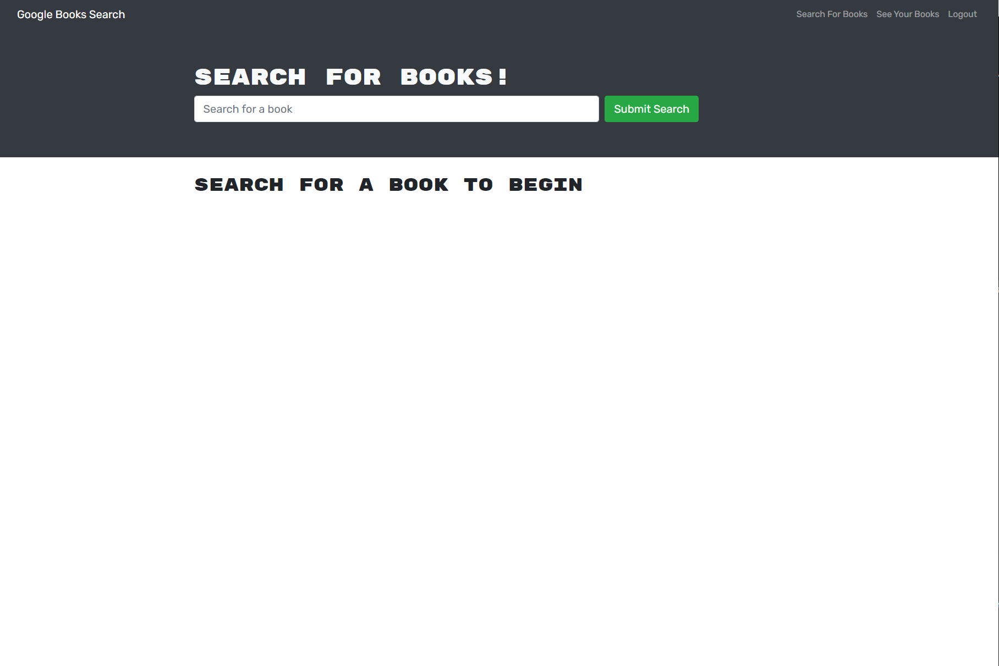
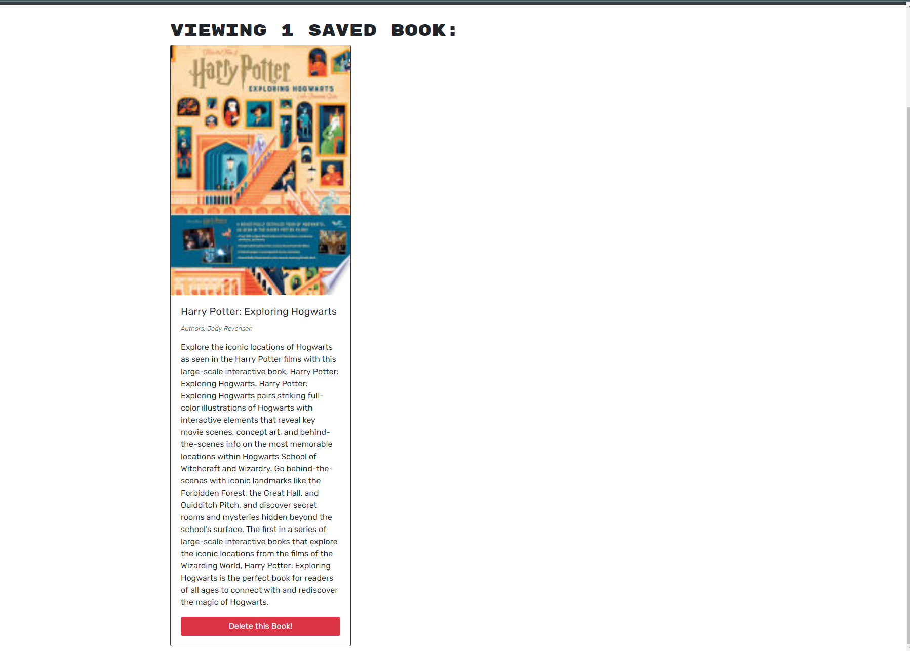
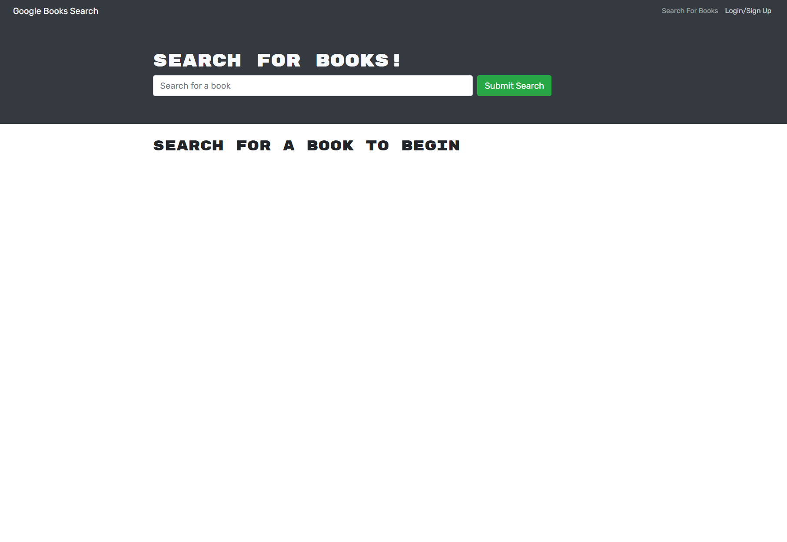
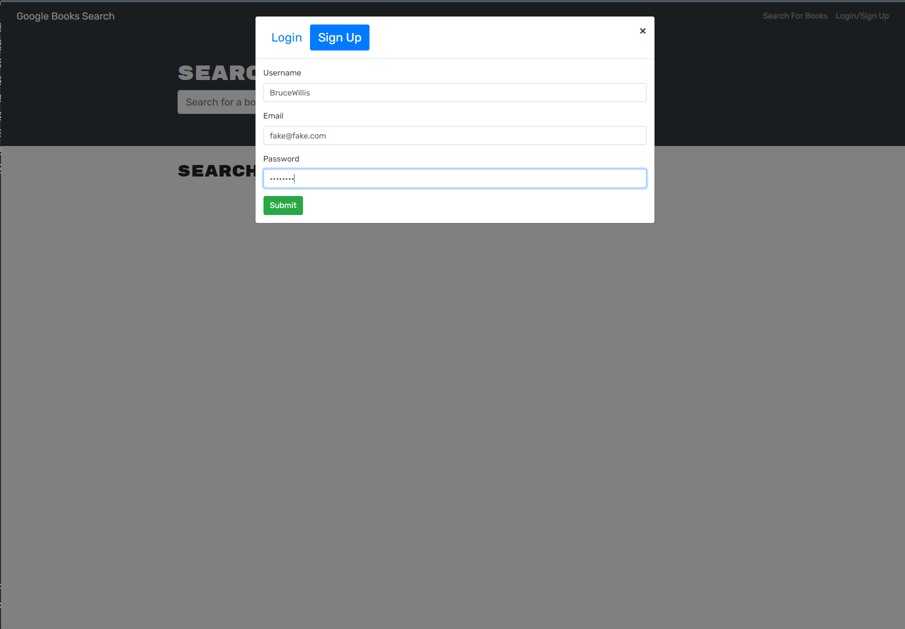

# Book Search [](https://opensource.org/licenses/MIT)

## Description
<p> This application was created to enjoy the convenience of searching and saving your favourite books. The application was created with GraphQL API built with Apollo Server.
</p>

<p>This application was created with [Node.js](https://nodejs.org/en/). The modules used include:</p>

- [apollo-server-express](https://www.npmjs.com/package/apollo-server-express)

- [bcrypt](https://www.npmjs.com/package/bcrypt)

- [express](https://www.npmjs.com/package/express)

- [graphql](https://www.npmjs.com/package/graphql)

- [json-web-token](https://www.npmjs.com/package/jsonwebtoken)

- [mongoose](https://www.npmjs.com/package/mongoose)

- [concurrently](https://www.npmjs.com/package/concurrently)

- [apollo-client](https://www.npmjs.com/package/@apollo/client)

- [bootstrap](https://www.npmjs.com/package/bootstrap)

    
## Table of Contents 
- [Screenshots](#Screenshots)
- [Installation](#Installation)
- [Usage](#Usage)
- [License](#License)
- [Contribution](#Contribution)
- [Tests](#Tests)
- [Questions](#Questions)
- [Links](#Links)

## Screenshots

<p>Homepage</p>

- 

<p>Book deleted</p>

- 

<p>Book saved</p>

- 

<p>Delete book</p>

- 

<p>Main Page</p>

- 

<p>Searched Books</p>

- 

<p>Sign Up</p>

- 

<p>View Saved</p>

- 

## Installation 
<p>To install this application please follow these instructions:</p>

- Please have node and npm installed.

- The application will be invoked by using the following command:

 ```
  git clone git@github.com:seanscott95/Book-Search.git
 ```

- To start, make sure your are in the root repository and run ```npm run install``` to install the modules needed for this application.

- Then run ```npm start``` to start the application.

## Usage 
- Theres nothing technical about the usage at all. You type and the text editor does the rest. It'll save anything and everything you type in on and offline automatically.

## License 
<p> This application is covered under the:</p>

- [MIT-License](https://opensource.org/licenses/MIT)

## Contribution 
<p> None.</p>

## Tests 
<p> This application was not developed using Test Driven Development.</p>

## Questions 
<p> To reach me with additional questions please contact me via one of the following methods: </p>

- GitHub: [GitHub](https://github.com/seanscott95)
- Email: [Email](mailto:seanms418@gmail.com)
- LinkedIn: [LinkedIn](https://www.linkedin.com/in/sean-scott-18ba07225/)

## Links
- GitHub: [GitHub-Link](https://github.com/seanscott95/Book-Search)
- Heroku: [Heroku-Link](https://boiling-tundra-33578.herokuapp.com/)